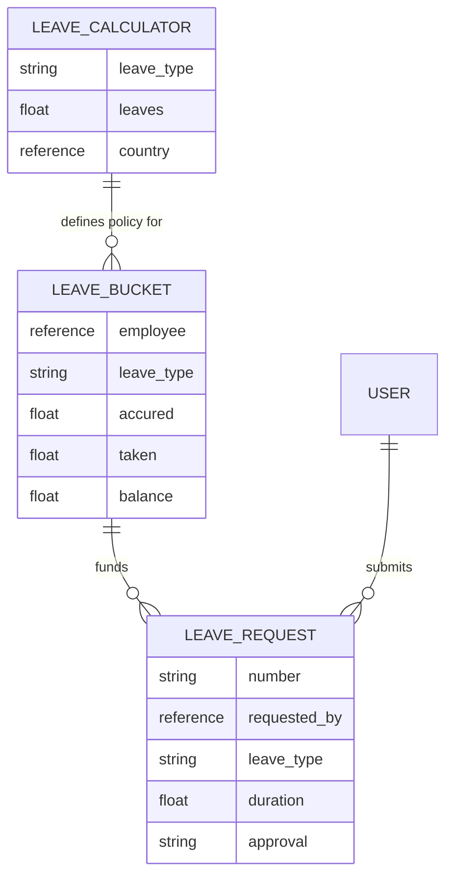
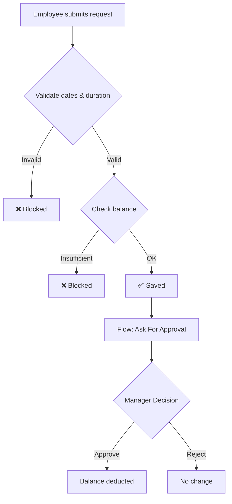

# 🗓️ Leave Management System

A fully automated, self-service Leave Management application built natively on the **ServiceNow** platform.

Employees submit leave requests through a Service Portal; requests are validated in real time against live leave balances; approvals route automatically to the correct manager via Flow Designer; and leave balances update themselves the instant a request is approved — with zero manual HR intervention.

---

## ✨ Key Features

- Fully automated request lifecycle — numbering, duration calculation, balance validation, and balance deduction, with no manual data entry
- Dynamic manager routing via Flow Designer — resolves each employee's actual Manager at runtime, no hardcoded approver
- Real-time balance validation — over-limit requests are blocked at submission, not caught later
- Country-ready policy engine via a dedicated Leave Calculator table
- Audit-safe by design — every request keeps a frozen snapshot of balance at submission time
- Role-based security enforced through ACLs (Employee / Manager / HR Admin)

---

## 🏗️ Data Model

| Table | Purpose |
|---|---|
| **Leave Calculator** | Policy config - leave entitlement per type/country |
| **Leave Bucket** | Live ledger - current balance per employee/leave type |
| **Leave Request** | Individual requests, with an audit snapshot of balance |

---

## 🔄 Request Lifecycle

---

## 🧩 Components

| Component | Count |
|---|---|
| Custom Tables | 3 |
| Business Rules | 5 |
| Client Scripts | 3 |
| UI Policies | 2 |
| UI Actions | 2 |
| Flow Designer Flows | 1 |
| Custom Roles | 3 |
| Portal Widgets | 4 |

---

## 🛠️ Tech Stack

ServiceNow Scoped Application · Business Rules & GlideRecord · Flow Designer · Service Portal Widgets · ACL-based security

---

## 🚀 Setup

1. Import the application into your instance (Studio or Update Set).
2. Assign roles: `employee`, `manager`, `hr_admin`.
3. Configure Leave Calculator policies for your countries/leave types.
4. Create initial Leave Bucket records per employee.
5. Publish the Service Portal pages and activate the Approval Flow.

---
 
## 📸 Screenshots & Demo
 
| Leave Request Form | User Records |
|---|---|
|  |  |
 
| Leave Management Table | System Studio |
|---|---|
|  |  |
 
**Application form:**
 

 
**🎥 Demo Video:** [Watch the full walkthrough](./Project%20Demo/Demo%20Video.mp4)
 
---

## 📂 Documentation

| Phase | Covers |
|---|---|
| [Phase-1 Requirement Analysis and Planning](./docs/Phase-1-Requirement-Analysis-and-Planning.md) | Objectives, scope, stakeholders |
| [Phase-2 Backend Development & Configurations](./docs/Phase-2-Backend-Development-and-Configurations.md) | Data model, business rules |
| [Phase-3 UI-UX Development & Customization](./docs/Phase-3-UI-UX-Development-and-Customization.md) | Portal, dashboards |
| [Phase-4 Data Migration, Testing & Security](./docs/Phase-4-Data-Migration-Testing-and-Security.md) | QA, ACLs, migration |
| [Phase-5 Deployment](./docs/Phase-5-Deployment.md) | Release, demo |
| [Project Conclusion](./docs/Project-Conclusion.md) | Outcomes, roadmap |

---

⭐ If you found this project useful, consider giving it a star!
